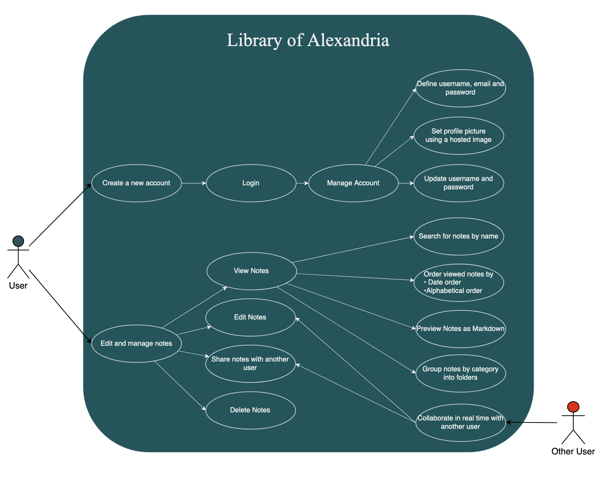
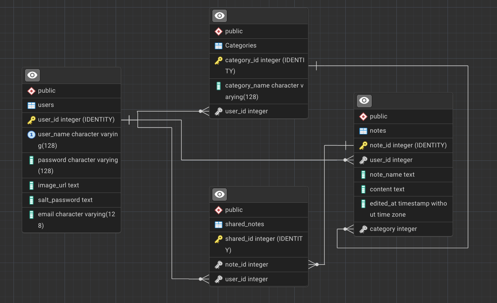

# Project Report (15 Marks)

# 1. Introduction

## 1.1 Overview
Library Of Alexandria is a collaborative note-taking web application that supports real-time collaboration on shared notes. The application provides users with the ability to write, edit, and render notes in Markdown using a React.js user interface styled with Tailwind CSS, along with regular CSS classes for styling purposes. To ensure real-time updates, WebSockets are integrated to allow multiple users to collaborate simultaneously. The app uses the ReactMarked library to render Markdown.

On the backend, the application is powered by Node.js and connects to a PostgreSQL database, which is normalized to Third Normal Form (3NF) to ensure data integrity. The backend API is built using REST. Authentication is a key feature, ensuring secure access to user-specific notes. The approach to authentication is flexible and designed to meet modern web security standards.

The backend is powered by an Express application to manage API routing and server deployment. The RESTful API connects to a PostgreSQL database hosted on a remote server. Authentication is integrated to ensure secure access to user-specific notes, and the approach uses Auth.js to remain flexible and meet modern web security standards

## 1.2 Contributions
- **Andre** (24923273)
* I was initially tasked with setting up the user interface of the notes page, accessible after logging in or signing up. After implementing the basic layout, I connected most of the front-end components to the backend to either retrieve necessary information or handle updates and deletions in the database. I also added some additional features, such as the dark mode context and the autosaving. Furthermore, I implemented a few SQL queries when needed and included error checks where necessary.

- **Dieter** (25047612)
* Initially started on the backend with the api functions and ended up contributing mainly on the front end. Developed and integrated the live note editing functionality with websockets and helped with error checking and other small tasks in between.
- **Matthew Holm** (26067404):
* Worked mainly on front-end/ui, with a focus on responsive design, overall look and feel, as well as the colour schemes. Also aided in debugging when integrating front and back-ends, and dabbled with integrating certain backend features.
- **Ludwig** (25325957)
* Mainly responsible for backend implementation, including initial database setup and the creation of tables and presenting queries to the front end for integration. Also generated the documentation for the backend.
- **Liam** (26620863)
* Mainly responsible for backend implementation, server hosting and management, and Postgres server configuration and hosting. Backend work included authentication, express configuration and middleware, database setup, API request handling, and HTTP communications. Also helped out when needed, with a focus on the backend and networking issues.

## 2. Use Case Diagram (3 Marks)
- Include a use case diagram illustrating the main actors and their interactions with the system.
- Briefly describe the primary use cases.

- Primary Use Cases:
   - Login
      - The User can login to an existing account or create a new one
      - The User can set their username and password
      - The User can set their profile picture to any hosted image
   - Notes
      - View Notes
      - Edit Notes
      - Share Notes with others

## 3. Data Modelling (3 Marks)
- Explain the data structure used in the project.
- Include an Entity-Relationship (ER) diagram or other relevant data model.
- Describe how the data entities interact.

There are 4 tables in the database:
   - Users: tracking all users and login information [password values are hashed]
   - Notes: tracking all of the notes, who they belong to and under what Category they fall, if any
   - Categories: linking together category names and notes, so that they can be shared between users
   - Shared_Notes: tracking which Notes have been shared with which Users

All data in the database is linked together so that upon deletetion of entries on which an entry is existence dependent, the dependent entry will also be deleted.

The database has also been normalised to minimise the amount of redundant data present.

## 4. Operating Environment and Major Dependencies (2 Marks)
- Specify the operating environment (e.g., OS, cloud, local servers).
- List any major dependencies such as libraries, APIs, or external services.

### Operating Environment
- Server:
   - Home server
   - Ubuntu
   - Database:
      - PostgreSQL database
      - Hosted on the server
      - API defined and exposed using Express [A NodeJS framework]

### Major Dependencies
 - Front End:
   - React for responsive HTML pages
   - TailwindCSS for styling
   - Socket.io for syncing different users' note editing areas

 - Back End:
   - NodeJS with Express as a server logic framework
   - Socket.io for web socket communication
   - Auth.js for authentication and authorization of API access
   - Socket.io where the server acts as the middle man between all users editing a note

- Database
   - PostgreSQL

## 5. Authentication (2 Marks)

# TODO

### Authentication Mechanisms (AuthN)

AuthN is the process of verifying a users identity before they are allowed to access the website. The primary authentication mechanisms include:

1. **Password-based Authentication**: Users can create accounts and log in using a username/email and password combination. (Implemented)

2. **Multi-factor Authentication (MFA)**: Supports various second-factor options like Time-based One-Time Passwords (TOTP), SMS-based verification codes, and Email-based verification codes. (Not implemented in this case)

3. **OAuth 2.0 and OpenID Connect**: Supports integration with popular OAuth providers, allowing users to log in using their accounts from services like Google, Facebook, or GitHub. (Partially implemented, could be fully implemented using the existing Auth.js system with a fairly low amount of modification)

4. **JWT (JSON Web Tokens)**: Uses JWTs for secure transmission of authentication information between the client and server. (Used to authenticate most API calls, and to determine which user made a specific request)

### User Verification Process

1. **Registration**: Users provide necessary information to create an account. Each password is hashed and salted using it's own unique salt value, and that salt value is then stored along with the salted password to be used to during the login process.

2. **Login**: Users enter their credentials, which Auth.JS verifies against stored information. The entire process is performed locally on the server, and due to the hashing and salting process there is not a very high likelihood that a user's password can be reverse-engineered even if the hacker has access to the raw data stored on the database.

3. **Authentication**: Upon successful verification, Auth.js generates a JWT containing the user's identity and permissions. This token will expire after it has been idle for 1 hour, and is required for most of the API calls.

### Session Management

Auth.js handles session management through the use of JWTs:

1. **Token Generation**: After successful authentication, Auth.js generates a JWT containing user identity, token expiration time, and other relevant session information.

2. **Token Storage**: The client stores the JWT, as an encrypted HTTP-only cookie.

3. **Token Usage**: The client includes the encrypted JWT in each request to protected resources.

4. **Token Refresh**: Auth.js can issue both access tokens (short-lived) and refresh tokens (long-lived) for maintaining sessions. (not fully implemented)

5. **Logout**: To end a session, the client discards the JWT. Token revocation can be implemented server-side for added security.

### Authorization Mechanisms (AuthZ)

AuthZ complements AuthN by determining what authenticated users are allowed to do within the system. Key aspects of AuthZ include:

1. **Role-Based Access Control (RBAC)**:
   - Users are assigned roles (e.g., admin, manager, user).
   - Each role is associated with a set of permissions.
   - Access to resources or actions is granted based on the user's role.
   - (not fully implemented)

2. **Attribute-Based Access Control (ABAC)**:
   - Access decisions are made based on attributes associated with the user, resource, or environment.
   - Provides more fine-grained control than RBAC.

3. **Policy-Based Access Control**:
   - Access rules are defined in policies.
   - These policies can incorporate both roles and attributes for complex access decisions.

### Authorization Process

1. **Token Inspection**:
   - When a request is made, the AuthZ system inspects the JWT provided by the AuthN system.
   - It extracts information such as user ID, roles, and other claims.

2. **Permission Evaluation**:
   - The AuthZ system checks the user's permissions against the required permissions for the requested resource or action.
   - This may involve looking up role permissions, evaluating policy rules, or checking specific user attributes.

3. **Access Decision**:
   - Based on the evaluation, the AuthZ system decides whether to grant or deny access.
   - If access is granted, the request proceeds; if denied, an error response is returned.

4. **Audit Logging**:
   - Authorization decisions are mostly logged for audit purposes and security analysis.

### Integration of AuthN and AuthZ

1. **JWT Claims**:
   - Auth.js includes authorization-related information (like roles or permissions) in the JWT claims.
   - This allows for efficient authorization checks without needing to query a separate database for each request.

2. **Middleware Integration**:
   - AuthZ checks are implemented as middleware in the application stack.
   - This middleware verifies the JWT from AuthN and applies AuthZ rules before allowing access to protected routes or resources.

3. **Fine-grained Control**:
   - While AuthN provides a binary authenticated/not authenticated decision, AuthZ allows for much more nuanced access control within the application.

By combining AuthN and AuthZ, the system ensures that users are not only who they claim to be but also that they have the appropriate permissions for their actions within the system. This comprehensive approach provides a robust security model for protecting resources and managing user access.

### Extera notes on Authentication:
- Users are not able to access the database directly, and all queries are parameterized, which provides sanitization using the extensive, well tested, parameter substitution system within the database server itself.
- No sensitive information is passed to the API as either a header or as part of the url.

## 6. High-Level Description of Design Patterns for the Client and API (3 Marks)
- Describe the key design patterns used for the client-side and API development.
- Explain how these patterns contribute to the scalability and maintainability of the system.

### Back End

The backend was designed with the goal of maximising simplicity of calling routes by the front-end focused members. The goal was to provide a single point of interaction with the backend in JavaScript by listing a number of request functions in frontEndRequests.ts. This meant that the front end team did not have to worry about the implementation details of the backend team.

Additionally, the backend was set up so that there is a clear stack structure for the addition of new features: First, a query to the table must added to the relevant /controllers file. Then, the API routes are defined in the /routes file. Then, a function is defined in frontEndRequests for use in the front end. The separation of functionality definitions helps to clarify the purpose of each function being written.

Finally, it quickly became clear that the mass amount of test data inserted into the database had a polluting effect. To avoid having to manually update each table in pgAdmin (an interface for managing a PostgreSQL database), the script `initDatabase.ts` was created to clear all old information and populate the database with known values.

### Front End
The frontend was designed with simplicity and responsiveness in mind. The goal was to provide users with not only a clear and concise, but elegant and lively UI. Responsiveness was maintained with frequent (but not excessive) state updates using `ContextUpdate`. Since the backend was so wonderfully setup, it allowed for easy integration into the frontend buttons,tabs, etc.

Frontend was also used for some security and searching features. If one tried to access the `/notes` route without having any proper authentication/login/signup credentials, we implemented a check for if userID was undefined - if this was the case, then the user would be redirected to the login/signup page instantly without any troubles.

The UI is, in general, quite modular which allows for various features to be plugged in wherever necessary. This enables scalability. Tailwind CSS was used in tandem with regular CSS classes to ensure maintainable and easily editable stylesheets. The dark mode/light mode implementation also aids accessibility.

### Websockets

The websocket functionality was added using the Socket.IO library. This library was used as it provided automatic reconnection to the server when a client disconnects and it is much more rich in functionality as we used websocket rooms as a way to ensure that only clients that have shared their notes can do live collaboration. Additionally, as Socket.IO states, it can work on all different environments and browsers both old and new, making it a good choice for using on any device.

How it essentially works is that all users, once connected to the note app in the browser, are given a random/unique socket ID with which they connect to the server and once a note is shared with them, the server allows them to connect to a websocket room, which acts as an environment in which all users that have access to that file (via sharing) can then do live-collaboration and thus prevents anyone from accessing the note. This provides a quick and effective way for notes to be written by multiple users while the server ensures security by only allowing access to those that have been granted it.

## 7. Additional Features
- The application is hosted on a public facing server (via Liam's generosity).
- Dark/Light modes, easy to switch.
- Autosave functionality which autosaves notes every 5 seconds.
- Ability to move notes between books/categories.
- Can use ANY image on the internet for a profile picture, provided the raw image link.
